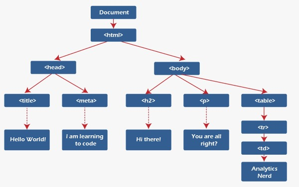

# REACT NOTES 

## What is React.JS?

* React.js is a popular **open-source JavaScript library** used to build user interfaces for web applications. It was developed by `Facebook` and has been widely adopted by the web development community for its simplicity, speed, and flexibility.

* In a nutshell, React allows developers to create reusable UI components that can be combined to form complex user interfaces. Each component encapsulates its own logic and state, making it easier to reason about the behavior of the application.

* React is based on a concept called the **virtual DOM**, which is a lightweight representation of the actual DOM (Document Object Model). 
* When a user interacts with a React component, the virtual DOM is updated to reflect the changes, and then React efficiently updates only the necessary parts of the actual DOM to reflect those changes. This results in better performance and a smoother user experience.

**There are two kinds of programming,**
* Declarative Programming
* Imperative Programming

*Declarative Programming:*<br>
Its main goal is to get desired output without describing how to get it .
*Imperative Programming:*<br>
Its main goal is to describe how to get output or accomplish it
**React is Declarative in nature.**

* Finally, React can be used with other popular front-end libraries and frameworks, such as Redux for managing state and React Router for routing. It also has a large and active community, which provides helpful resources and support for developers.


## React Vs Angular Vs Vue


| Feature    | React     | Vue      | Angular    |
| :----------| :---------| :--------|:---------- |
| `Created by`      | Facebook | Evan You |Google|
| `Initial Release`      | 2013 | 2014. |2010 |
| `Architecture`      | Component-based | Component-based |Component-based |
| `Learning Curve`      | Low | Low |High |
| `Performance`      | High | High. |High |
| `Data Binding`      | One-way | Two-way | Two-way |
| `Templating`      | JSX | Html-based |Html-based |
| `State Management`      | Redux, Context API | Vuex |RxJS, ngrx |
| `Ecosystem`      | Large | Growing |Large |

# React features

## 1. React: The Virtual Dom
### DOM: 
DOM stands for Document Object Model. 
Normally, whenever a user requests a webpage, the browser receives an HTML document for that page from the server. The browser then constructs a logical, tree-like structure from the HTML to show the user the requested page in the client.

This tree-like structure is called the Document Object Model, also known as the DOM. It is a structural representation of the web document as nodes and objects, in this case, an HTML document.



### The problem with Dom

> DOM manipulation is the heart of the modern, interactive web. Unfortunately, it is also a lot slower than most JavaScript operations.
> This slowness is made worse by the fact that most JavaScript frameworks update the DOM much more than they have to.

## Virtual Dom 

* React contains a lightweight representation of real DOM in the memory called Virtual DOM.  
* DOM gets created whenever any React application gets loaded on the screen for the first time, Whenever React components gets mounted on the screen for the first time.
* Now when any user makes any changes on the screen like button click, then the changes will not directly go to Real Dom.
* So, we are having two virtual doms, one VDOM gets created at the time of mounting of react component so it is a copy of your real DOM.
* Another VDOM is the dom which contains the new changes, updated state variables values.
* Now these two virtual DOMs will get compared with each other and will check for the new changes this complete procedure is known as **`diffing algorithm.`**
* Now the new changes will be updated in your Real DOM, this procedure is known as **`Recoinciliation`**
This makes a big difference! React can update only the necessary parts of the DOM. React’s reputation for performance comes largely from this innovation.

In summary, here’s what happens when you try to update the DOM in React:

1. he entire virtual DOM gets updated.
2. The virtual DOM gets compared to what it looked like before you updated it. React figures out which objects have changed.
3. The changed objects, and the changed objects only, get updated on the real DOM.
4. Changes on the real DOM cause the screen to change.

## 2. SPA
 * A single-page application (SPA) is a type of web application that loads a single HTML page and dynamically updates the content as the user interacts with the application. In a traditional web application, clicking on a link or submitting a form would typically result in a request to the server, which would respond with a new HTML page to be rendered in the browser. In contrast, a SPA loads all the necessary HTML, CSS, and JavaScript files upfront and then communicates with the server in the background to fetch or update data as needed.

* React is a popular JavaScript library for building SPAs. React allows developers to create reusable UI components that can be composed together to create complex user interfaces. React components are declarative, meaning they describe what should be rendered on the page rather than how it should be rendered. This makes it easier to reason about the code and to make changes without introducing bugs.

* In a React SPA, the initial HTML page typically only contains a single "div" element, which serves as the entry point for the React application. When the page loads, React renders the initial UI based on the state of the application. As the user interacts with the application, React updates the UI in response to events such as button clicks or form submissions.

* To handle server requests, a React SPA typically uses an API (Application Programming Interface) to communicate with the server. The API provides a set of endpoints that the client-side code can use to fetch or update data. The client-side code sends requests to the server using the Fetch API or other libraries such as Axios or jQuery. When the server responds, the client-side code updates the state of the application and rerenders the UI as needed.

> One advantage of using a React SPA is that it can provide a smoother and more responsive user experience compared to traditional web applications, since the page does not need to reload every time the user interacts with it. However, SPAs can be more complex to build and maintain, since they require more client-side code and may require additional server-side infrastructure to support the API.

## 3. JSX and Babel
JSX is a syntax extension for JavaScript that allows developers to write HTML-like code within their JavaScript code. It was developed by Facebook as part of the React library and is used extensively in React applications.

With JSX, developers can write code that looks like HTML, but is actually a combination of JavaScript and HTML. For example, instead of creating a DOM element using plain JavaScript like this:

```javascript

const element = document.createElement('div');
element.innerText = 'Hello, world!';
```
In JSX, the same code can be written as:

```javascript
const element = <div>Hello, world!</div>;
```
> JSX is not a separate language, but a syntax extension that is transformed into plain JavaScript by a compiler such as **Babel.**
### Babel:
Babel is a JavaScript compiler that allows developers to use modern JavaScript syntax and features while still supporting older browsers that do not support these features. Babel can compile JSX code into plain JavaScript code that can be run in any modern web browser.

In addition to transforming JSX code, Babel can also transform other modern JavaScript features such as arrow functions, template literals, and classes into code that can run in older browsers. Babel does this by analyzing the code and replacing any unsupported features with equivalent code that can be run by older browsers.

Overall, JSX and Babel are important tools in the React ecosystem, allowing developers to write modern, expressive code that can be run on a wide range of web browsers.

## 4. One Way Binding
* One-way data binding is a data flow mechanism in which the data flows only in one direction, from the data source to the UI element. This means that when the data changes, the UI element that is bound to the data is automatically updated to reflect the new data, but the reverse is not true.

* In one-way data binding, changes made to the UI element do not update the data source. If the user changes a value in the UI, the change is not automatically propagated back to the data source. Instead, the developer must explicitly update the data source based on the new value in the UI.
> One advantage of one-way data binding is that it can simplify the code and reduce the risk of unintended consequences. Since the data flow is unidirectional, it is easier to reason about the code and to track the source of changes. Additionally, one-way data binding can improve performance by reducing the number of updates that need to be made to the UI.

Example: 

```javascript
import React, { useState } from 'react';

function Example() {
  const [count, setCount] = useState(0);

  return (
    <div>
      <p>You clicked {count} times.</p>
      <button onClick={() => setCount(count + 1)}>
        Click me
      </button>
    </div>
  );
}
```
This is an example of one-way data binding, as the value of count flows from the state variable to the UI element (the paragraph element), but changes made to the UI element do not affect the state variable.

If we were using two-way data binding, we would need to define an event handler for the paragraph element to update the state variable when the user changes the text. However, in one-way data binding, the paragraph element is only used to display the current value of the 'count' variable, and does not update the variable when clicked or changed.

## 5. Component based
* Component-based architecture: React allows developers to build complex UIs by breaking them down into small, reusable components. Each component is responsible for rendering a small part of the UI, and can be composed together to create larger, more complex UIs.
* There are two types of components in React 
1. Class based components
2. Functional based components

## 6. Named export and default export
A named export allows you to export multiple values from a module, and each of those values can be imported individually by their name. A default export, on the other hand, allows you to export a single value from a module, and that value can be imported using any name.

Here's an example of a module with named exports:

```javascript
// math.js
export const add = (a, b) => a + b;
export const subtract = (a, b) => a - b;
```
In this example, the math.js module exports two functions: add and subtract. These functions can be imported individually like this:

```javascript
import { add, subtract } from './math.js';
console.log(add(2, 3)); // Output: 5
console.log(subtract(5, 2)); // Output: 3
```
> Note that when importing named exports, you need to use the curly braces and specify the names of the exports you want to import.

Now, let's take a look at an example of a module with a default export:

```javascript
// greeting.js
const greeting = name => `Hello, ${name}!`;
export default greeting;
```
In this example, the greeting.js module exports a single function called greeting. This function can be imported using any name like this:

```javascript
import sayHello from './greeting.js';
console.log(sayHello('John')); // Output: Hello, John!
```
> Note that when importing a default export, you don't need to use curly braces and can specify any name for the import.

In summary, named exports allow you to export multiple values from a module, and default exports allow you to export a single value from a module.

## 7. Community support
React has a significant advantage of community support, which is one of the reasons for its popularity among developers. The React community is very active and passionate about the technology, and there are many resources available to help developers learn and solve problems.

Here are some ways in which the React community provides support:

*Documentation*: React has comprehensive documentation that is regularly updated with new features and changes. The documentation is clear and easy to follow, making it an excellent resource for both beginners and experienced developers.

*Online forums and communities*: There are many online forums and communities where developers can ask questions, share knowledge, and discuss best practices related to React. These communities include Stack Overflow, Reddit, GitHub, and more.

*Third-party libraries and tools*: The React community has created many third-party libraries and tools that can help developers work more efficiently with React. These include libraries for state management, routing, styling, testing, and more.

*Conferences and meetups*: There are many conferences and meetups dedicated to React, where developers can attend talks, workshops, and networking events. These events provide an opportunity to learn from experts in the field and connect with other developers.

*Open-source contributions*: React is an open-source project, which means that anyone can contribute to its development. The React community has a strong culture of open-source contributions, and many developers have contributed code, bug fixes, and documentation to the project.

## 8. Web and Mobile 
React is effective for both web and mobile development because it allows developers to write reusable code that can be shared between different platforms.

React Native, a mobile framework built on top of React, allows developers to write mobile applications using the same programming language and development concepts as web applications. This makes it easier for developers to transition between web and mobile development, and to build applications that work seamlessly across both platforms.

Some of the features that make React effective for both web and mobile development include:

*Cross-platform compatibility*: React's focus on reusable components and virtual DOM makes it possible to write code that works on both web and mobile platforms. This reduces development time and cost, and makes it easier to maintain code across multiple platforms.

*Third-party libraries and tools*: The React community has developed many third-party libraries and tools that can be used to build web and mobile applications. These tools include libraries for state management, routing, styling, testing, and more, which can help developers work more efficiently and effectively.

# Components
## Class Components:

In React, class-based components are a type of component that is defined using a JavaScript class. They are an older method of defining components, and have largely been replaced by functional components in modern React development. However, they are still commonly used in legacy code and in some specialized cases.

Class-based components are defined using the class keyword, and they extend the React.Component class. They define a render() method that returns a React element, which describes the UI that should be rendered to the screen.

Here is an example of a class-based component:

```javascript
import React from 'react';

class ExampleComponent extends React.Component {
  render() {
    return (
      <div>
        <h1>Hello, world!</h1>
      </div>
    );
  }
}
```
> In this example, we define a class-based component called `ExampleComponent`. It extends the `React.Component` class and defines a `render`() method that returns a `div` element containing an `h1` element.

Class-based components have a few advantages over functional components, such as the ability to define state and lifecycle methods. However, they also have some disadvantages, such as being more verbose and harder to understand for beginners.

In general, functional components are preferred for modern React development, as they are easier to write and maintain, and provide better performance. However, class-based components are still a valuable tool in the React developer's toolbox, and can be useful in some specialized cases.

### what is constructor and super key word?
**constructor** are used for 2 purposes : <br>
In React class components to initialize the component's state and to bind event handlers.<br>

**super()** is used to call the constructor of its parent class. If we would like to set a property or access this inside the constructor we need to call super() method. 

> It is not necessary to have a constructor in every component.

> It is necessary to call super() within the constructor. To set property or use 'this' inside the constructor it is mandatory to call super().


### React Component with Constructor
```javascript

import React from 'react'; 
import ReactDOM from 'react-dom'; 
class Main extends React.Component { 
  constructor() { 
    super(); 
    this.state = { 
      planet: "Earth" 
    } 
  } 
  render() { 
    return ( 
      < h1 >Hello {this.state.planet}!</h1> 
    ); 
  } 
} 
ReactDOM.render(<Main />, document.getElementById('root')); 
```
output:
```
Hello Earth          
```
<!-- In this example, we define a class-based component called `ExampleComponent`. We define a `constructor` method that calls the `super` method to initialize the component's `props` and sets the component's initial state to an object with two properties, `name` and `age`. We then use the `name` and `age` state properties in the `render` method to display a message on the screen. -->

This is a very basic example, but it demonstrates how the constructor and super keywords are used to initialize a React class component's state.

### React Component without Constructor 
```javascript
import React from 'react'; 
import ReactDOM from 'react-dom'; 
class Main extends React.Component { 
  state = { 
    planet: "Mars" 
  } 
  render() { 
    return ( 
      < h1 >Hello {this.state.planet}!</h1> 
    ); 
  } 
} 
ReactDOM.render(<Main />, document.getElementById('root')); 
```
output:
```
Hello Mars! 
```

## Functional component
In React, function-based components are a newer and more lightweight way to define components than class-based components. They are defined using JavaScript functions and can be considered as pure functions that take in props and return a React element.

Here is an example of a function-based component:

```javascript
import React from 'react';

function ExampleComponent(props) {
  return (
    <div>
      <h1>Hello, {props.name}!</h1>
    </div>
  );
}
```
In this example, we define a function-based component called `ExampleComponent`. It takes in a `props` parameter, which is an object containing any props that are passed to the component. It returns a `div` element containing an `h1` element that displays the `name` prop.

Function-based components have several **advantages** over class-based components:

* They are simpler and more lightweight than class-based components, which makes them easier to read, write, and maintain.

* They are less verbose than class-based components, which means less boilerplate code.

* They are easier to test because they are just plain functions that take in props and return a React element.

* They are faster than class-based components, because they don't have the overhead of a class instance and lifecycle methods.

In summary, function-based components are a simpler and more lightweight way to define components in React. They are easier to read, write, and maintain, and provide better performance than class-based components. For these reasons, they have become the preferred way to define components in modern React development.

### Q. Is there any reason to still use react class components?

Yes, there are still some reasons to use React class components, although function components are now the preferred way of writing components in React.

Here are a few reasons why you might still choose to use React class components:

1. Legacy Codebase: If you are working on a legacy codebase that uses class components, it might be more efficient to continue using class components rather than rewriting all of your code.

2. Lifecycle Methods: React class components have access to a number of lifecycle methods that are not available to function components. If you need to use one of these lifecycle methods, such as componentDidMount or componentDidUpdate, you will need to use a class component.

3. More Explicit: Some developers prefer the more explicit nature of class components. With class components, everything is defined in one place, making it easier to see what's going on in your code.

That being said, function components are generally considered the better choice for new React projects, as they offer better performance, simpler syntax, and easier testing. However, there are still some cases where class components might be the better option.

## Functional component Vs Class component


|     | Functional Components |	Class Components |
| :---| :---------------------| :----------------|
|`Definition`|	Defined as a JavaScript function |	Defined as a JavaScript class|
|`Stat-Management` |	Uses useState and useEffect hooks to manage state and lifecycle methods|	Uses state and lifecycle methods inside the class|
|`Props`|	Passed in as an argument to the function | Passed in as a property to the class|
|`Lifecycle-Methods`|	Uses useEffect hook to manage component lifecycle	|Has access to lifecycle methods such as componentDidMount and componentDidUpdate|
|`Performance`|	Generally faster because they do not have to create an instance of the component|	Slightly slower because they have to create an instance of the component|
|`Syntax`|	Simpler and easier to read and understand|	More verbose and complex|
|`Code-Reusability`|	Can be easily reused in other components	|Cannot be easily reused in other components|
|`Testing`|	Easier to test because they are pure functions|	More difficult to test because they have state and lifecycle methods|
|`Refs`|	Cannot use refs directly inside the component|	Can use refs directly inside the component|


# State and Props
## State:
* In React, a "state" is an object that represents the internal data of a component. It is used to manage the component's dynamic behavior and to render the component with updated information.
* The data is passed within the components only.State can be modified. State can be used only in class component. 

* State can be changed by using the **setState()** method, which is provided by the React framework. When a component's state changes, React automatically re-renders the component with the updated information.

* State is typically used to handle user input, control component behavior, and store component-specific data.

* It's important to note that state is meant to be used only within the component it belongs to. It should not be passed down to child components as props, as this can make the code harder to maintain and debug.

## Props:
* React is a component-based library that divides the UI into little reusable pieces. In some cases, those components need to communicate (send data to each other) and the way to pass data between components is by using props.

* “Props” is a special keyword in React, which stands for properties and is being used for passing data from one component to another.

* But the important part here is that data with props are being passed in a uni-directional flow. (one way from parent to child)

* Furthermore, props data is read-only, which means that data coming from the parent should not be changed by child components.

### Props in class component
In a class component in React, props can be accessed via the this.props object. Here's an example of how to use props in a class component:

*#Greeting.js*
```javascript
import React from 'react';

class Greeting extends React.Component {
  render() {
    return <h1>Hello, {this.props.name}!</h1>;
  }
}

export default Greeting;
```
In this example, the `Greeting` class extends React.Component and defines a `render` method that returns a greeting message with the value of the name `prop` passed to it.

When the Greeting component is used in another component, the name prop can be passed as an attribute, like this:

*#App.js*
```javascript
import React from 'react';
import Greeting from './Greeting';

class App extends React.Component {
  render() {
    return (
      <div>
        <Greeting name="Alice" />
        <Greeting name="Bob" />
      </div>
    );
  }
}

export default App;
```
In this example, the App class extends React.Component and renders two instances of the Greeting component, each with a different name prop passed to it. When the Greeting component is rendered, it accesses the value of the name prop via this.props.name and uses it to render the greeting message.

### Props in functional component
Here's an example of how to use props in a functional component:

*#Greeting.js*
```javascript
import React from 'react';

function Greeting(props) {
  return <h1>Hello, {props.name}!</h1>;
}

export default Greeting;
```
In this example, the Greeting component is a simple functional component that receives a name prop and uses it to render a greeting message.

When the Greeting component is used in another component, the name prop can be passed as an attribute, like this:

*#App.js*

```javascript
import React from 'react';
import Greeting from './Greeting';

function App() {
  return (
    <div>
      <Greeting name="Alice" />
      <Greeting name="Bob" />
    </div>
  );
}

export default App;
```

In this example, the `App` component is rendering two instances of the `Greeting` component, each with a different name prop. When the Greeting component is rendered, it will receive the name prop as an argument to its function, and the value of the name prop will be used to render the greeting message.

## Difference between State and Props

|Property|	State|	Props|
| :------| :-----| :-----|
|`Source`|	Defined and managed within a component|	Passed from a parent component to a child|
|`Mutability`|	Mutable and can be changed within a component	|Read-only and cannot be modified|
|`Ownership`|	Owned by the component that defines it|	Owned by the parent component|
|`Usage`|	Used to manage data within a component|	Used to pass data down the component tree|
|`Updates`|	Changes trigger a re-render of the component	|Changes trigger a re-render of the component|
|`DefaultValues`|	Must be initialized by the component itself	|Can have default values defined by the parent|
|`Scope`|	Should only be accessed and modified within component|	Can be accessed by child components|

## Update State and props using class component
1. Updating State:

* To update the state, you need to call the `setState` method.
* setState method accepts an object that contains the new values of the state properties you want to update.
* It's important to note that setState is asynchronous, so you should not rely on the current state or props values when updating state.
Here's an example:
```javascript
class MyComponent extends React.Component {
  constructor(props) {
    super(props);
    this.state = {
      count: 0,
    };
  }

  handleClick = () => {
    this.setState({ count: this.state.count + 1 });
  };

  render() {
    return (
      <div>
        <p>Count: {this.state.count}</p>
        <button onClick={this.handleClick}>Increment</button>
      </div>
    );
  }
}
```
2. Updating Props:

* Props are read-only and cannot be directly modified by the component that receives them.
* However, you can pass new props to a component by re-rendering it with new prop values.
* To update props, you need to call the `setState` method of the parent component that passed the props to the child component.
* When the parent component updates its state, it triggers a re-render of the child component with the new prop values.
Here's an example:
```javascript
class ParentComponent extends React.Component {
  constructor(props) {
    super(props);
    this.state = {
      name: "John",
    };
  }

  handleClick = () => {
    this.setState({ name: "Mary" });
  };

  render() {
    return (
      <div>
        <ChildComponent name={this.state.name} />
        <button onClick={this.handleClick}>Change Name</button>
      </div>
    );
  }
}

function ChildComponent(props) {
  return <p>Hello {props.name}</p>;
}
```
In summary, to update state, you call the setState method with the new state values. To update props, you update the parent component's state, which triggers a re-render of the child component with the new prop values.

## Update State and props using functional component

1. Update State
* To update state in functional components, you need to use the useState hook provided by React.
* The useState hook returns an array with two values: the current state value and a function that can be used to update the state value.
* To update the state value, you call the function returned by the useState hook with the new state value.
Here's an example:
```javascript
import React, { useState } from "react";

function MyComponent() {
  const [count, setCount] = useState(0);

  const handleClick = () => {
    setCount(count + 1);
  };

  return (
    <div>
      <p>Count: {count}</p>
      <button onClick={handleClick}>Increment</button>
    </div>
  );
}
```
2. Updating Props:

* Props are read-only and cannot be directly modified by the component that receives them, regardless of whether it is a functional component or a class component.
* To update props in functional components, you need to pass new prop values from the parent component.
* When the parent component updates its state, it triggers a re-render of the child component with the new prop values.
Here's an example:
```javascript
import React from "react";

function ParentComponent() {
  const [name, setName] = useState("John");

  const handleClick = () => {
    setName("Mary");
  };

  return (
    <div>
      <ChildComponent name={name} />
      <button onClick={handleClick}>Change Name</button>
    </div>
  );
}

function ChildComponent(props) {
  return <p>Hello {props.name}</p>;
}
```
In summary, to update state in functional components, you use the useState hook to update the state value. To update props, you pass new prop values from the parent component.

### >How to pass data from parent to child? 
In React, you can pass data from a parent component to a child component using props. 

*#Parent Component:*

```javascript
import React from 'react';
import ChildComponent from './ChildComponent';

function ParentComponent() {
  const data = {
    name: 'John Doe',
    age: 25,
    city: 'New York',
  };

  return (
    <div>
      <ChildComponent data={data} />
    </div>
  );
}

export default ParentComponent;
```
*#Child Component:*

```javascript
import React from 'react';

function ChildComponent(props) {
  const { data } = props;

  return (
    <div>
      <p>Name: {data.name}</p>
      <p>Age: {data.age}</p>
      <p>City: {data.city}</p>
    </div>
  );
}
export default ChildComponent;
```
In this example, the ParentComponent passes the data object to the ChildComponent as a prop. The ChildComponent then receives the data object as a prop, and can access its properties using dot notation (data.name, data.age, data.city) within the function body.


## Conditional Rendering
* Conditional rendering is a technique in React that allows you to render different content or components based on certain conditions. 
* It's a powerful way to make your components more dynamic and responsive to user input.

```javascript

import React, { useState } from 'react';

function Example() {
  const [showText, setShowText] = useState(false);

  const handleClick = () => {
    setShowText(!showText);
  };

  return (
    <div>
      <button onClick={handleClick}>Toggle Text</button>
      {showText && <p>Some text to show when button is clicked</p>}
    </div>
  );
}
export default Example;
```
* In this example, we use the useState hook to create a boolean state variable called `showText`. The initial value is false, which means the text won't be shown initially.

* We also define a function called `handleClick` that toggles the value of `showText` between true and false.

* In the return statement, we render a button with an `onClick` event listener that calls handleClick when clicked. 
* We also use a conditional statement to render the text only when `showText` is true. If `showText` is false, the text won't be rendered.

* When the user clicks the button, the handleClick function is called, which toggles the value of showText. This causes the component to re-render, and the text will be shown or hidden based on the new value of showText.

Note that the conditional statement used here is a shorthand way to write an if statement. The expression { showText && `<p>`Some text to show when button is clicked`</p>` } means "if showText is true, render the `<p>` element; otherwise, render nothing".

**There are several techniques for performing conditional rendering in React:**

1. If statements: You can use regular if statements to conditionally render content. For example:

```javascript
function MyComponent(props) {
  if (props.isLoggedIn) {
    return <p>Welcome back!</p>;
  } else {
    return <p>Please log in.</p>;
  }
}
```
2. Ternary operator: You can use a ternary operator to create a more concise if/else statement. For example:

```javascript
function MyComponent(props) {
  return (
    <div>
      {props.isMember ? <p>Welcome, member!</p> : <p>Please sign up.</p>}
    </div>
  );
}
```
3. Logical && operator: You can use the logical && operator to conditionally render content. For example:

```javascript
function MyComponent(props) {
  return (
    <div>
      {props.hasData &&
        <ul>
          {props.data.map(item => <li key={item.id}>{item.name}</li>)}
        </ul>
      }
    </div>
  );
}
```
4. Switch statement: If you have multiple conditions to check, you can use a switch statement to conditionally render content. For example:

```javascript
function MyComponent(props) {
  switch (props.status) {
    case 'loading':
      return <p>Loading...</p>;
    case 'error':
      return <p>Error: {props.errorMessage}</p>;
    case 'success':
      return <p>Success!</p>;
    default:
      return null;
  }
}
```

# Life Cycle Methods:

In React, lifecycle methods are special methods that allow you to perform actions at specific stages in a component's lifecycle. These methods are called automatically by React at different points in the component's life.

There are three phases in the React component lifecycle: mounting, updating, and unmounting. Each of these phases has its own set of lifecycle methods.
1. **Mounting:** The component is ready to mount in the browser DOM. This phase covers initialization from
The phase covers initialization from
* constructor()
* render()
* componentDidMount()
2. **Updating:** In this phase, the component gets updated by, sending the new props and updating the state from setState()
This phase covers initialization From
The phase covers initialization from
* shouldComponentUpdate()
* render()
* componentDidUpdate()
3. **Unmounting:** In this phase, the component is not needed and gets unmounted from the browser DOM.
The phase covers initialization from
* componentWillUnmount()

## Mounting:
The mounting means to put elements into the DOM. React uses virtual DOM to put all the elements into the memory. It has four built-in methods to mount a component namely.
1. Constructor()
2. render()
3. componentDidMount()

**Constructor()**
method is called when the component is initiated and it’s the best place to initialize our state. The constructor method takes props as an argument and starts by calling super(props) before anything else.
```javascript
import React, { Component } from 'react'

export default class App extends Component {
  constructor(props){
    super(props)
    this.state = {
      name: 'Constructor Method'
    }
  }
  render() {
    return (
      <div>
       <p> This is a {this.state.name}</p>
      </div>
    )
  }
}
```
**render()**
* The render() function does not modify the component state, it returns the same result each time it’s invoked and is
responsible for describing the view to be rendered to the browser window.
* render() is called by React at various app stages, generally when the React component is first instantiated, or when there is a new update to the component state.

> Note : render() will not be invoked if shouldComponentUpdate() returns false.

**componentDidMount()**
The most common and widely used lifecycle method is componentDidMount. This method is called after the component is rendered.

```javascript
import React, { Component } from 'react'

export default class componentDidMountMethod extends Component {
  constructor(props){
    super(props)
    this.state = {
      name: 'This name will change in 5 sec'
    }
  }
  componentDidMount() {
    setTimeout(() => {
      this.setState({name: "This is a componentDidMount Method"})
    }, 5000)

  }
  render() {
    return (
      <div>
       <p>{this.state.name}</p>
      </div>
    )
  }
}
```
output:
```
This is a componentDidMount Method 
```
The above example will print This is a componentDidMount Method after 5 sec. This proves that the method is called after the component is rendered.

## Updating
This is the second phase of the React lifecycle. A component is updated when there is a change in state and props React basically has five built-in methods that are called while updating the components.
1. shouldComponentUpdate()
2. render()
3. componentDidUpdate()

**shouldComponentUpdate()**
 is used when you want your state or props to update or not. This method returns a boolean value that specifies whether rendering should be done or not. The default value is true.
 ```javascript
 import React, { Component } from 'react'

export default class shouldComponentUpdateMethod extends Component {
  constructor(props){
    super(props)
    this.state = {
      name: 'shouldComponentUpdate Method'
    }
  }
  shouldComponentUpdate() {
    return false; //Change to true for state to update
  }

  componentDidMount(){
    setTimeout(() => {
      this.setState({name: "componentDidMount Method"})
    }, 5000)
  }
  render() {
    return (
      <div>
       <p>This is a {this.state.name}</p>
      </div>
    )
  }
}
```
**componentDidUpdate** method is called after the component is updated in the DOM. This is the best place in updating the DOM in response to the change of props and state.

```javascript
import React, { Component } from 'react'

export default class componentDidUpdateMethod extends Component {
    constructor(props){
        super(props)
        this.state = {
            name: 'from previous state'
        }
    }
    componentDidMount(){
        setTimeout(() => {
            this.setState({name: "to current state"})
          }, 5000)
    }
    componentDidUpdate(prevState){
        if(prevState.name !== this.state.name){
            document.getElementById('statechange').innerHTML = "Yes the state is changed"
        }
    }
    render() {
        return (
            <div>
                State was changed {this.state.name}
                <p id="statechange"></p>
            </div>
        )
    }
}
```
In the above example, you will notice that first I have initialized the name state inside the constructor method and after that changed state using setState inside `componentDidMount` method. So basically the name state should be changed from "`shouldComponentUpdate` Method" to `“componentDidMount` Method” after `5` seconds but it didn’t change because of `shouldComponentUpdate` set to `false`, If you change that true the state will be updated.

**componentDidUpdate()**<br>
The componentDidUpdate method is called after the component is updated in the DOM. This is the best place in updating the DOM in response to the change of props and state.

```javascript
import React, { Component } from 'react'

export default class componentDidUpdateMethod extends Component {
    constructor(props){
        super(props)
        this.state = {
            name: 'from previous state'
        }
    }
    componentDidMount(){
        setTimeout(() => {
            this.setState({name: "to current state"})
          }, 5000)
    }
    componentDidUpdate(prevState){
        if(prevState.name !== this.state.name){
            document.getElementById('statechange').innerHTML = "Yes the state is changed"
        }
    }
    render() {
        return (
            <div>
                State was changed {this.state.name}
                <p id="statechange"></p>
            </div>
        )
    }
}
```
In the above example, I have set the name state to to current state So React will render the `name` state from State was changed from previous state to State was changed to current state after `5` seconds. Using the conditional checking of the current state with the previous state **prevState.name !== this.state.name** inside the `componentDidUpdate` method, we are updating the value of the id `statechange` to `Yes the state is changed .`


**componentWillUnmount()**<br>
If there are any cleanup actions like canceling API calls or clearing any caches in storage you can perform that in the componentWillUnmount method. You cannot use setState inside this method as the component will never be re-rendered.

```javascript

import React, { Component } from 'react'

export default class componentWillUnmount extends Component {
    constructor(props){
        super(props)
            this.state = {
                show: true,
            } 
    }
    render() {
        return (
            <>
              <p>{this.state.show ? <Child/> : null}</p>
               <button onClick={() => {this.setState({show: !this.state.show})}}>Click me to toggle</button>
            </>
        )
    }
}

export class Child extends Component{
    componentWillUnmount(){
        alert('This will unmount')
    }
    render(){
        return(
            <>
            I am a child component
            </>
        )
    }
}
```
In the above example, I have created a simple toggle button which will show our `Child component` if the state is set to true. 

So after clicking on the button an alert will popup displaying `This will unmount` The alert will popup because the component is about to be removed from the DOM which in our case is the Child component.

## Events in react
<p>Event handling essentially allows the user to interact with a webpage and do something specific when a certain event like a click or a hover happens. </p>
<p>When the user interacts with the application, events are fired, for example, mouseover, key press, change event, and so on.</p>


The actions to which JavaScript can respond are called events. Handling events with react is very similar to handling events in DOM elements.

Below are some general events that you would see in and out when dealing with React-based websites:  

* Clicking an element  
* Submitting a form 
* Scrolling page 
* Hovering an element  
* Loading a webpage 
* Input field change 
* User stroking a key 
* Image loading 

### DIFFERENCE BETWEEN HTML AND REACT EVENT HANDLING :
React event handling is similar to HTML with some changes in syntax, such as:

React uses camelCase for event names while HTML uses lowercase.

Instead of passing a string as an event handler, we pass a function in React.

Example:
In HTML:
```
<button onclick="clickHandler()">
  Clicked
</button>
```
In React js
```
<button onClick={clickHandler}>
  Clicked
</button>
```
Also, like in HTML, we cannot return false to prevent default behavior; we need to use preventDefault to prevent the default behavior.

In HTML
```
<form onsubmit="console.log('clicked'); 
   return false">
  <button type="submit">Submit</button>
</form>
```
In React js
```javascript
function Form() {
  function handleClick(e) {
    e.preventDefault();
    console.log('Clicked');
  }

  return (
    <form onSubmit={handleClick}>
      <button type="submit">Submit</button>
    </form>
  );
}
```
Here, e is a synthetic event. React events do not work exactly the same as native events. See the SyntheticEvent reference guide to learn more.

When using React, you generally don’t need to call addEventListener to add listeners to a DOM element after it is created. Instead, just provide a listener when the element is initially rendered.

**Changing state in onClick event listener:**

```javascript
function EventBind() {
  const [steps, setSteps] = useState(0);
  const clickHandler = () => {
    setSteps(steps + 1);
  };
  return (
    <>
      <div>{steps}</div> 
      <button onClick = {clickHandler}> Click </button>
    </>
  );
}
```
**Let’s see some of the event attributes:**   

* onmouseover: The mouse is moved over an element 
* onmouseup: The mouse button is released 
* onmouseout: The mouse  is moved off an element 
* onmousemove: The mouse is moved 
* Onmousedown: mouse button is pressed  
* onload: A image is done loading 
* onunload: Existing the page  
* onblur: Losing Focus  on element  
* onchange: Content of a field changes 
* onclick: Clicking an object  
* ondblclick: double clicking an object  
* onfocus element getting a focus  
* Onkeydown: pushing a keyboard key 
* Onkeyup: keyboard key is released 
* Onkeypress: keyboard key is pressed  
* Onselect: text is selected 


## What are synthetic events in ReactJS ?

In order to work as a cross-browser application, React has created a wrapper same as the native browser in order to avoid creating multiple implementations for multiple methods for multiple browsers, creating common names for all events across browsers. Another benefit is that it increases the performance of the application as React reuses the event object.

It pools the event already done hence improving the performance.


 > `e.preventDefault()` prevents all the default behavior by the browser.

> `e.stopPropagation()` prevents the call to the parent component whenever a child component gets called.

Note: **Here ‘e’ is a synthetic event**, a cross-browser object. It is made with a wrapper around the actual event of the browser. 


# Higher Order Compoent
App.js 
```javascript
import React from 'react' 
import ClickCounter from './ClickCounter' 
import HoverComp from './HoverComp' 
const App = () => { 
  return ( 
    <div> 
    <ClickCounter /> 
    <HoverComp /> 
    </div> ) } 
    
export default App
```
ClickCounter.js 
```javascript
import React, { Component } from 'react' 
import UpdatedComp from './UpdatedComp' 
class ClickCounter extends Component { 
  render() { 
    const { count, incrementCount } = this.props 
    console.log(incrementCount); 
    return ( 
      <button onClick={incrementCount}> Class {count} Times </button> 
      ) 
    } } 
export default UpdatedComp(ClickCounter)
```
HoverComp.js 
```javascript 
import React, { Component } from 'react' 
import UpdatedComp from './UpdatedComp' 
export class HoverComp extends Component { 
  render() { 
    const { count, incrementCount } = this.props 
    console.log(incrementCount); 
    return ( 
      <h2 onMouseOver={incrementCount}> Hovered {count} Times </h2> ) } }
      
export default UpdatedComp( HoverComp )
```
UpdatedComp.js
```javascript
import React,{Component} from "react"; 
const UpdatedComp = (OriginalComponent) => { 
  class NewComponent extends Component { 
    constructor(props) { 
      super(props) 
      this.state = { count : 0 } 
      } 
      
  incrementCount = () => { 
    this.setState( { count: this.state.count+1 } ) 
    } 
    render() { 
      return <OriginalComponent count={this.state.count} incrementCount={this.incrementCount} /> 
      } 
  } 
return NewComponent 
} 
export default UpdatedComp
```


# **HOOKS**

* In React, Hooks are functions that allow developers to use state and other React features in functional components without the need for class components. 

* Hooks were introduced in React version 16.8 to provide a simpler and more flexible way to manage state and side effects in React components.

* In class component we use different Life cycle methods but in functional components we use hooks instead.

* Hooks allows to use state and other features without writing a class. 

**Benefits of using Hooks and Why Hooks was introduced ?**

● In react class component, we split our work into different life-cycle methods like componentDidMount,
componentDidUpdate and componentWillUnmount, but in hooks, we can do everything in a single hook called useEffect.

● In the class component, we have to use this keyword and also we have to bind event listeners, which increases
complexity. This is prevented in react functional components.

**There is 2 rules to use Hooks.** 
1. Only call Hooks at the top level:-<p>
 Do not call hooks inside loops, conditions or nexted functions. Hooks should always be used at the top level of the react functions.

2. Only call hooks from React functions:- <p>
You can't call hooks from regular js functions instead you can call hooks from React functional component. 

There are several types of hooks in React such as: 
  * UseState
  * useEffect
  * useMemo
  * useRef
  * UseReducer
  * UseCallback
  * useContext
  * useParams 
  * useHistory 


## UseState
-> usestate hooks allows us to track state in a functional component.<p>
-> State generally refers to data or properties that need to be tracking in an application.<p>
-> usestate can be used to toggle between 2 values, usually true and false.

**How to use it**

first we have to import
```
import {usestate} from 'react'
```
then inside a function write
```
const[count.setCount]=usestate(0);
        |         |
        |         |
     (current    (Update the 
      state)     counter's state)
```
Example
```javascript
import React ,{useState} from "react";

function App() {
    const[Count,setCount]= useState(0);

    return(
        <>
        <h1> count:{Count}</h1>
        <button onClick={()=>setCount(Count+1)}>Click</button>
        </>
    )    
}
 export default App
```

In this example, we declare a state variable called count using the `useState` hook and initialize it to 0. We also declare a function called `setCount` which will be used to update the `count` state variable.

## useEffect
**->** The Effect Hook allows us to perform side effects (an action) in the function components. It does not use components lifecycle methods which are available in class components.

**->** In other words, Effects Hooks are equivalent to componentDidMount(), componentDidUpdate(), and componentWillUnmount() lifecycle methods.

**->** useEffect allows you to run side effects after the component has rendered, and also provides a way to clean up any side effects when the component is unmounted or updated. Here is an example of how to use useEffect:

Side effects have common features which the most web applications need to perform, such as:

* Updating the DOM,
* Fetching and consuming data from a server API,
* subscribing to events.

-> useEffect accepts 2 arguments (callback,[dependency])

> **The dependency array** is passed as the second argument to useEffect, and can contain one or more values. If the array is empty, the effect will only run once, when the component is mounted. If the array contains any values, the effect will re-run whenever one of those values changes.

```javascript
function App() {
    const[Count,setCount]= useState(0);
    const [num,setNum]= useState(0);

    useEffect(()=>{
        alert("clicked")
    })

    return(
        <>
        <h1> count:{Count}</h1>
        <button onClick={()=>setCount(Count+1)}>Click</button>
        <h1> Number:{num}</h1>        
        <button onClick={()=>setNum(num+1)}>Click</button>
        </>
    )    
}
export default App
```
Here we declare 2 states `setCount` and `setNum`. and add counter to both of them . And we use useeffect and alert. so when one user click on the both buttons in every render one alert will appear. 

Now lets use empty dependency
```javascript
  useEffect(()=>{
        alert("clicked")
    },[])
```
So we just add empty array dependency, now when ever the page is reload for the first time it will show alert. Then whenever we click on both buttons the alert will not popup.

```javascript
 useEffect(()=>{
        alert("clicked")
    },[num])
```    
Here we pass num state in the dependency.Now when we click on count state button the alert will not popup but whenever we click on num state button the alert will popup everytime we click on the button and simontaniouly the increment will occure.

## useMemo
useMemo is a React hook that allows you to memoize the result of a function, and recompute the result only when the dependencies of the function have changed.

In simple terms, useMemo can be used to optimize the performance of your React components by avoiding unnecessary re-renders.

```javascript
function App() {
  const [a, setA] = useState(0);
  const [b, setB] = useState(0);

  const result = useMemo(() => {
    console.log('Calculating result...');
    return a+b;
  }, [a,b]);

  return (
    <div>
      <p>Result: {result}</p>
      <button onClick={()=>setA(a+1)}>Increment A</button>
      <button onClick={()=>setB(b+1)}>Increment B</button>
    </div>
  );
}
```

In this example, we use useMemo to compute the sum of a and b, and store the result in the result variable. The useMemo function takes a callback function as its first argument, which is the function that we want to memoize. 

The second argument is an array of dependencies that useMemo will use to determine when to recompute the result.

useMemo can be used for more complex computations as well. For example, if you have a component that does a lot of expensive calculations, you can use useMemo to avoid recalculating those values every time the component re-renders.

> In summary, useMemo is a React hook that can be used to memoize the result of a function and optimize the performance of your components. By avoiding unnecessary re-renders, you can create faster and more efficient React applications.

## useCallback

useCallback will return a memoized version of the callback that only changes if one of the dependencies has changed. This is useful when passing callbacks to optimized child components that rely on reference equality to prevent unnecessary renders.

In simple terms, useCallback can be used to optimize the performance of your React components by avoiding unnecessary re-renders of child components.

```javascript
import React, { useState, useCallback } from 'react';

function MyComponent(props) {
  const [count, setCount] = useState(0);

  const handleClick = useCallback(() => {
    setCount(count + 1);
  }, [count]);

  return (
    <div>
      <p>Count: {count}</p>
      <button onClick={handleClick}>Increment Count</button>
      <ChildComponent handleClick={handleClick} />
    </div>
  );
}

function ChildComponent(props) {
  return (
    <div>
      <p>Child component</p>
      <button onClick={props.handleClick}>Increment Count</button>
    </div>
  );
}

export default MyComponent;
```

In this example, we use useCallback to memoize the `handleClick` function that is passed as a prop to the ChildComponent. The useCallback function takes a callback function as its first argument, which is the function that we want to memoize. The second argument is an array of dependencies that useCallback will use to determine when to re-create the function.

In this case, the handleClick function is only re-created when the count state changes. This means that if the handleClick function is passed as a prop to a child component, and that child component re-renders, the handleClick function will not be re-created unless the count state changes.

### Advantage:
useCallback can be useful when you have a function that is passed down to multiple child components, and you want to avoid unnecessary re-renders of those components. By memoizing the function, you can ensure that it is only re-created when necessary, which can improve the performance of your React components.

> In summary, useCallback is a React hook that can be used to memoize a function and optimize the performance of your components. By avoiding unnecessary re-creation of functions, you can create faster and more efficient React applications.


## useRef
useRef is a React hook that allows you to create a mutable reference to an element or value, which persists across re-renders of your component.

In simple terms, useRef can be used to store values that don't change often and are not used for rendering purposes, such as DOM elements, timers, or any other mutable value.

```javascript
import ReactDOM from "react-dom/client"; 
function UseRef() { 
  const [inputValue, setInputValue] = useState(""); 
  const count = useRef(0); 
  useEffect(() => { 
    count.current = count.current + 1; }); 
    return ( 
      <> 
        <input type="text" 
        value={inputValue} onChange={(e) => 
        setInputValue(e.target.value)} /> 
        <h1>Render Count: {count.current}</h1> 
      </> ); 
      } 
      
export default UseRef;
```

## useReducer
It does very similiar to setState, It's a different way to manage state using Redux Pattern. Instead of updating the state directly, we dispatch actions, that go to a reducer function, and this function figure out, how to compute the next state.

```javascript
 function App() { 
  const initial = 0; 
  const reducer = (state, action) => { 
    switch (action) { 
      case "add": return state + 1; 
      case "sub": return state - 1; 
      case "reset": return 0; 
      default: return 0; 
    } 
  } 
  const [value, dispatch] = useReducer(reducer, initial) return ( 
    <div> 
    <h2>{value}</h2> 
    <button onClick={() => dispatch("add")}>Add</button> 
    <button onClick={() => dispatch("sub")}>subtract</button> 
    <button onClick={() => dispatch("reset")}>reset</button> 
    </div> 
    ); 
  }
```

  # Routing
  ## What is a React Router ?
* React Router is a powerful routing library built on top of React that helps to flow your application incredibly quickly, while
keeping the URL in sync with what's being displayed on the page.

* When a user types a specific URL into the browser, and if this URL path matches any 'route' inside the router file, the user
will be redirected to that particular route.

* React Router Dom is used to build applications that have many pages or components but the page is never refreshed
instead the content is dynamically fetched based on the URL

**Q.What is the difference between react-router and react-router-dom ?**

In React Router v4, the React Router was broken into two: react-router and react-router-dom. react-router is the core, and
react-router-dom is the core plus the React Router elements such as
`<BrowserRouter>` and `<NavLink>`
Since react-router-dom is like a super-set of react-router, you only need to import react-router-dom.

### **What is BrowserRouter ?**
BrowserRouter is responsible for understanding the url and then going ahead and ensuring that ui that we have or component we have is as per that particular url

Installation
```
npm i react-router-dom
```
### **What is Routes ?**
The Routes component is used to define the routes for your application. It takes one or more Route components as its children and renders the first Route that matches the current URL. If none of the Route components match the current URL, the Routes component renders nothing.

### **What is Route ?**

The Route component is used to define a single route in your application. It takes two props: path and element. The path prop specifies the URL pattern that the Route should match, and the element prop specifies the component that should be rendered when the Route matches.

### **What is path ?**

The path prop is used to specify the URL pattern that a Route should match. It can be a string or a regular expression that matches the desired URL pattern. For example, if you want to match the URL /about with a Route, you would set the path prop to "/about".

### **What is Link in React ?**
Link is a primary way to allow users to navigate around your application from page to another without loading
The difference between link and anchor tag is that

● anchor tag when we navigate to another page there is a loading happen

● Link when we navigate to another page through link the page will not load.

**How to use links in React ?**

Initially we are on Home page , on click of Home we move to about page and there is a change in url(localhost:3000/about)


Here lets take one simple example how to perform routing .
We are taking 3 pages Home, About, Contact. And i place them in ul tag as a link so that whwnever we click on particular link it will redirect to that page.


*#index.js*
```javascript
import React from 'react';
import ReactDOM from 'react-dom/client';
import './index.css';
import App from './App';
import { BrowserRouter } from 'react-router-dom';

const root = ReactDOM.createRoot(document.getElementById('root'));
root.render(
  <React.StrictMode>
    <BrowserRouter>

    <App />
    
    </BrowserRouter>

  </React.StrictMode>
);
```

*#App.js*
```javascript
import './App.css';
import Home from './component/Home';
import About from './component/About';
import Contact from './component/Contact';
import {Routes,Route,Link} from 'react-router-dom'

function App() {
  return (
    <>
     <ul>
    <li><Link to="/">Home</Link></li>
    <li><Link to="/about">About</Link></li>
    <li><Link to="/contact">Contact</Link></li>
    </ul>
  
    <Routes>
      <Route path="/"  element={<Home/>}/>
      <Route path="/about"  element={<About/>} />
      <Route path="/contact"  element={<Contact/>}/>
    </Routes>
    </>
  );
}
export default App;
```

*./component/Home.js*

```javascript
import React from "react"

const Home=()=>{
    return (
        <>
        Home
        </>
    )
}
```
export default Home

*./component/About.js*

```javascript
import React from "react"

const About=()=>{
    return (
        <>
        About
        </>
    )
}
export default About
```

*./component/Contact.js*

```javascript
import React from 'react'

const Contact = () => {
  return (
    <div>Contact</div>
  )
}

export default Contact
```


## Dynamic params in Routing

Dynamic parameters in routing refer to a feature in React Router that allows you to define URL patterns with variable segments. This is useful when you want to create routes that can handle a wide range of inputs without having to define a separate route for each one.

Here's a simple example of how to use dynamic parameters in React Router:

// App.js
```javascript
import { BrowserRouter as Router, Routes, Route } from 'react-router-dom';
import Home from './Home';
import User from './User';

function App() {
  return (
    <Router>
      <Routes>
        <Route path="/" element={<Home />} />
        <Route path="/users/:id" element={<User />} />
      </Routes>
    </Router>
  );
}

export default App;
```

// Home.js
```javascript
import { Link } from 'react-router-dom';

function Home() {
  return (
    <div>
      <h1>Home</h1>
      <ul>
        <li><Link to="/users/1">User 1</Link></li>
        <li><Link to="/users/2">User 2</Link></li>
        <li><Link to="/users/3">User 3</Link></li>
      </ul>
    </div>
  );
}

export default Home;
```

// User.js

```javascript

import { useParams } from 'react-router-dom';

function User() {
  const { id } = useParams();

  return (
    <div>
      <h1>User {id}</h1>
      <p>This is the page for User {id}.</p>
    </div>
  );
}

export default User;
```

In this example, we have three components:

* App: The top-level component that defines the routing for the app using Routes and Route.
* Home: A simple component that displays a list of links to different user pages.
* User: A component that displays information about a specific user, based on the dynamic parameter id in the URL.

When a user clicks on a link to a user page, React Router will match the URL to the Route for User and pass the id parameter as a prop. The User component then uses the useParams hook to extract the id parameter and render information specific to that user.